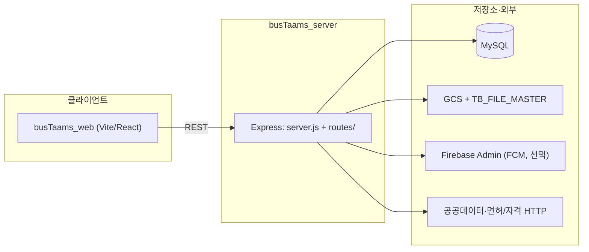

# BusTaams 아키텍처

## 1. 프로젝트 개요

버스타암스(BusTaams)는 여행자와 버스 기사를 직접 매칭하는 특허 시스템 기반의 전세버스 중개 플랫폼입니다. 본 문서는 Node.js 기반의 백엔드 통합 이후의 최신 시스템 구조를 정의합니다.

## 2. 폴더 구조 및 역할

저장소 루트(`bus-taams/`) 기준 실제 구조는 아래와 같습니다. (관리자 앱은 Stitch 기반 별도 구성으로 운영하거나, 별도 저장소에 둘 수 있습니다.)

```
bus-taams/
├── busTaams_server/          # 통합 백엔드 (Node.js, Express)
│   ├── server.js             # HTTP 진입점, 대부분의 REST 라우트 등록
│   ├── loadEnv.js            # 환경 변수 로드 (busTaams_server/.env)
│   ├── db.js                 # DB 풀·연결
│   ├── crypto.js             # 암·복호화 (개인정보 필드 등)
│   ├── driverVerification.js # 기사 자격·면허 검증 연계 로직
│   ├── routes/               # 분리된 라우트 모듈 (일부는 server.js에서 마운트)
│   ├── lib/                  # 공통 유틸, DTO, ID·파일·채팅 등 도메인 헬퍼
│   ├── services/             # 외부 연동·푸시 등 보조 서비스
│   ├── sql/                  # DDL·마이그레이션용 SQL 스크립트
│   └── .env / .env.example   # 비밀·엔드포인트 설정 (.gitignore로 .env 제외)
│
├── busTaams_web/             # 사용자용 프론트엔드 (여행자·기사, Vite + React)
│   ├── src/                  # UI 컴포넌트, 앱 라우팅, API 클라이언트 호출
│   ├── public/               # 정적 자산
│   └── index.html            # Vite 엔트리
│
├── bustaams_admin/           # (참조) 관리자 전용 대시보드 — Stitch 기반, 별도 배포·저장소일 수 있음
│   └── modules/              # 승인, 정산, 모달 리스트 관리 등
│
└── ARCHITECTURE.md           # 본 아키텍처 설계 문서
```

**프론트에서 API 기준 URL:** 환경 변수 `VITE_API_BASE_URL` 등으로 `busTaams_server`와 통신합니다.

## 3. 핵심 설계 원칙

### 3.1 백엔드 통합 (Backend Consolidation)

- 기존 Java 기반 `busTaams_api`는 폐기되었으며, **DB 접근과 비즈니스 로직은 `busTaams_server`가 전담**합니다.
- **통합 API:** `busTaams_web`과 관리자(배포 주체에 따라 `bustaams_admin` 또는 동일 API 소비 클라이언트)는 **동일한 `busTaams_server` REST API**를 통해 데이터를 처리합니다.

### 3.2 식별자 규격 (Identifier Standards)

- **CUST_ID 중심:** 여행자·기사·영업 파트너 등 회원 단위의 **내부 식별·조인·구독·취소·파일 소유는 `CUST_ID`를 단일 기준**으로 맞춥니다.
- **DB 무결성:** `TB_USER` 및 연관 테이블 간 트랜잭션·조인 시 **`CUST_ID`를 핵심 키**로 설계·점검합니다.
- *(구현 세부)* 로그인·레거시 호환을 위해 `USER_ID` 컬럼이 `TB_USER`에 존재할 수 있으나, **도메인 데이터 축에서는 `CUST_ID` 우선**으로 통일하는 것을 원칙으로 합니다.

## 4. 주요 서비스 로직

### 4.1 매칭 및 정산 시스템

- **역경매 매칭:** 여행자의 청약 등록 후 기사 승인이 완료되면 **상호 연락처가 공개**되는 흐름을 전제로 합니다.
- **자동 완료(Batch):** 운행 종료 **익일 새벽(예: 00:00:01)** 에 시스템이 자동으로 서비스 완료 처리 및 정산 데이터 생성을 수행하는 것을 목표로 합니다. (배치 실행 주체·스케줄은 운영 환경에 맞게 구성)

### 4.2 자격 및 금융 검증 (External API)

- **실시간 검증:** 공공데이터포털·한국교통안전공단(운수종사 자격)·도로교통공단 계열(면허 진위, URL/키 기반 설정) 등 **외부 HTTP API**와 연동할 수 있도록 `driverVerification.js`에 모듈화되어 있습니다. (실제 호출은 `.env`의 URL·키·플래그가 채워져야 동작)
- **결제·카드:** 기사 카드 등록 등 일부 흐름에서 **PG/INIpay 계열** 환경 변수(`INI_MID` 등)를 사용합니다. (`server.js`, `routes/busDriverCreditCardRegistrationRoute.js` 등)
- **1원 실명 인증:** 정산 계좌·실명 검증은 **PG/금융 API** 연동을 전제로 하며, 구체 엔드포인트는 환경·계약에 따라 `.env` 및 해당 라우트를 본다.

## 5. 관리자 대시보드 (Admin Dashboard)

- **모달 중심 UX:** 신규 기사 승인, 영업 회원 정산, 약관 개정, 실시간 운행 이슈 로그 등을 **모달 형태**로 묶어 관리 효율을 높이는 것을 설계 방향으로 둡니다.
- **기술 스택:** Stitch 기반 관리자 UI 및 `modules` 단위 기능 구성을 전제로 서술하며, 실제 코드 위치는 조직의 저장소·배포 정책에 따릅니다.

## 6. 런타임·배포 (코드 기준)

| 구분 | 기본값·설정 | 근거 |
|------|-------------|------|
| API 서버 포트 | `PORT`, 미설정 시 **8080** | `server.js` (`process.env.PORT` 없으면 8080) |
| DB | MySQL **mysql2/pool**, `DB_HOST`·`DB_PORT`(기본 3306)·`DB_USER`·`DB_PASSWORD`·`DB_NAME`, 세션 TZ `+09:00` | `db.js`, `.env.example` |
| 웹 개발 서버 | Vite 기본 **5173**, `strictPort: true` | `vite.config.js` |
| 로컬 API 프록시 | `npm run dev` 시 `/api` → `http://127.0.0.1:8080` | `vite.config.js` |
| 프론트→API URL | `VITE_API_BASE_URL` 미설정 시 다수 컴포넌트가 `http://127.0.0.1:8080`(또는 `localhost:8080`) 사용; 비우면 상대 `/api` + Vite 프록시 조합 가능 | `busTaams_web/src/**/*.jsx` |
| 바디 크기 상한 | `express.json` / `urlencoded` **50mb** (이미지·Base64 업로드 대비) | `server.js` |

**기동:** 백엔드는 `busTaams_server`에서 `npm start` 또는 `node server.js`. 프론트는 `busTaams_web`에서 `npm run dev`.

## 7. 구성 요소·데이터 흐름



- **라우팅:** 대량의 엔드포인트는 `server.js`에 직접 정의되고, 채팅·카드·취소·입찰 목록 등은 `routes/*.js`에서 `require` 또는 `app.use`로 마운트됩니다.
- **파일·이미지:** 업로드·조회 시 `TB_FILE_MASTER`와 **Google Cloud Storage** 버킷(`GCS_BUCKET_NAME`, 기본값 예: `bustaams-secure-data`)을 사용하는 경로가 `server.js` 등에 구현되어 있습니다.

## 8. 인증·보안·개인정보 (구현 관점)

- **로그인:** `POST /api/auth/login` 및 별칭 `POST /api/users/login`. 비밀번호는 **bcrypt** 검증, 응답 `user` 객체는 클라이언트가 **localStorage 등에 보관**하는 패턴입니다. 서버 측 **JWT/세션 쿠키** 의존 코드는 현재 `server.js` 기준으로 두지 않습니다.
- **요청 보호:** API는 넓은 범위의 **CORS 허용**(`cors()` 기본 사용)으로 운영되는 구성이므로, 공개 배포 시 출처·인증 정책을 별도로 강화해야 합니다.
- **필드 암호화:** `crypto.js` — **AES-256-GCM**, 키는 `.env`의 **`ENCRYPTION_KEY`(64자 hex)**. 주민등록번호 등 민감 컬럼 저장 및 `plainOrLegacyDecrypt`로 이름·전화 등 레거시 암호문 호환.
- **파일 접근:** 기사·여행자 문서 조회 API는 요청의 **`custId`·`fileId` 조합** 등으로 소유·권한을 검사하는 패턴이 `server.js`·`lib/*`에 분산되어 있습니다.

## 9. 외부 연동 요약 (`driverVerification.js`·환경 변수)

| 목적 | 설정·모듈 (요약) |
|------|-------------------|
| 운수종사 자격 진위 | `PUBLIC_DATA_SERVICE_KEY` 또는 `DATA_GO_KR_SERVICE_KEY`, `TS_QUAL_VERIFY_URL`, `TS_QUAL_VERIFY_ENABLED` 등 |
| 면허 진위(B2B/전용 URL) | `KOROAD_LICENSE_VERIFY_URL`, `KOROAD_LICENSE_VERIFY_ENABLED`, 선택 `KOROAD_LICENSE_API_KEY` |
| FCM 푸시 | `FIREBASE_SERVICE_ACCOUNT_PATH` → `firebase-admin` 초기화; `services/chatPush.js`, `TB_USER_DEVICE_TOKEN`의 `CUST_ID` |
| 웹 푸시·전화 인증 | `busTaams_web`: `VITE_FIREBASE_*`, `VITE_FIREBASE_VAPID_KEY`, `firebasePhoneVerify.js`, `firebaseMessagingRegister.js` |

## 10. 데이터·스키마 단일 원본 (문서)

코드와 DDL을 맞출 때 아래를 우선 참조합니다.

- `BusTaams 테이블.md` — 통합 DDL·테이블 설명
- `BusTaams_Project 테이블 설계.md` — 프로젝트 관점 스키마
- `busTaams_web/BUSTAAMS_테이블 생성 쿼리 전체.md` — 생성 쿼리 편철
- `SERVER 환경.md` — 서버·스키마 정합·운영 메모
- `busTaams_server/sql/*.sql` — 마이그레이션·ALTER 스크립트

선택: 로컬에서 누락 테이블 자동 생성 시 `BUSTAAMS_AUTO_ENSURE_TABLES`(주석 처리된 예: `.env.example`).

## 11. 비즈니스 목표 vs 저장소 구현 (명시)

| 항목 | 문서/기획 서술 | 현재 저장소에서의 위치 |
|------|----------------|------------------------|
| 익일 새벽 자동 완료·정산 배치 | §4.1 목표 | **Node 프로세스 내 스케줄러(cron) 구현은 검색되지 않음.** 운영 배치·별도 워커·DB 이벤트 등으로 구현 예정일 수 있음. |
| 역경매·청약·연락처 공개 | §4.1 | `server.js`의 경매·예약·입찰 관련 라우트 및 화면 문서(`실시간 입찰`, `여행자 견적` 등)와 함께 검증 |
| 관리자 Stitch 대시보드 | §5 | **본 저장소에 `bustaams_admin/` 소스 없음** — 별도 저장소 또는 외부 도구 |

---

*문서 갱신: `busTaams_server/server.js`, `db.js`, `crypto.js`, `driverVerification.js`, `vite.config.js`, `busTaams_web` API 호출 패턴 기준으로 보강.*
