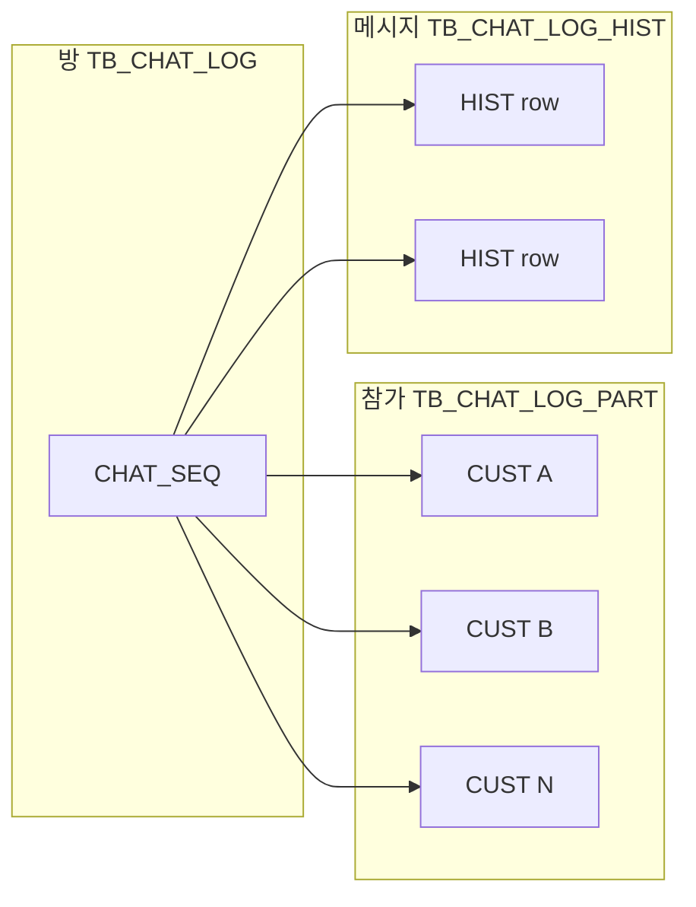

# 실시간채팅_버스기사 화면

## 1. 개요

- **식별자(LiveChatBusDriver)**: 프론트 컴포넌트 `LiveChatBusDriver`, REST 베이스 경로 `/api/live-chat-bus-driver`, 서버 모듈 `routes/liveChatBusDriver.js`.
- **데이터 모델(목표)**: **`TB_CHAT_LOG`(대화·방 1) + `TB_CHAT_LOG_PART`(참가자 N) + `TB_CHAT_LOG_HIST`(메시지)** — **1:1이 아닌 1(방) : N(참가자)**. UUID/BINARY 없이 `varchar(10)` `CUST_ID` 중심. 상세·DDL·FCM은 **섹션 4** 참고. *(옛 2인 전용 `CUST_ID_A`/`B` 모델·단일 `TB_CHAT_LOG` 로그는 **§4-7 레거시**·이력 참고.)*
- **UI 참고**: `downloads/bustaams_web/실시간 채팅_공통/LiveChat.html` 등. 대화 말풍선·하단 글래스 입력·좌측 견적 카드 스타일(원본 HTML의 좌측 “메시지” 리스트와 유사)을 따른다. HTML 전체 페이지의 **상단 네비·우측 “차량 및 경매 정보” 패널**은 모달에 포함하지 않는다.
- **진입**: `DriverDashboard` 바로가기 **「실시간 채팅」** → `LiveChatBusDriver` 모달.
- **전 회원·검색 기반 채팅(공통)**: `USER_TYPE`(여행자·영업회원·버스기사·관리직원)과 무관하게, 상대를 **`휴대전화`·`USER_ID`(로그인 ID)·`성명(USER_NM)`**으로 검색한 뒤 **채팅을 요청**할 수 있다. DB 저장·조인 키는 **`TB_USER.CUST_ID`**(내부 식별자)이다. *(검색·수락·1:N: **섹션 1-1, 2-0, 4-5, 4-8**.)*
- **예약 연동 채팅(기사·여행자 화면)**: `TB_BUS_RESERVATION.DATA_STAT` 가 **`CONFIRM`** 또는 **`DONE`** 인 경우에만, 해당 견적/예약 스레드가 **채팅 목록·전송**에 나타난다( **검색·초대로만 모인** 방은 `REQ/RES` 없을 수 있음). **`REQ`만** 있는 건 본 “예약 기준” 목록에서 제외할 수 있다(운영 정책).

### 1-0. 테이블 구조 변경: **1:1 대화** → **1(방) : N(참가자)** 채팅창

**기존(구):** 채팅을 **두 명(여행자·기사)만** 가정한 **1:1 대화**로 설계된 경우가 많다. DB는 (1) **`TB_CHAT_LOG` 한 테이블**에 **메시지마다 한 행**을 쌓고, `TRAVELER_ID`·`DRIVER_ID`·`SENDER_ID`만으로 상대를 구분하거나, (2) **고정 2인 컬럼**(`CUST_ID_A`/`B`)으로 **참가자를 스키마에 박아 두는** 형태였다. **같은 방에 관리자·영업 등 셋째 인원**을 넣기 어렵고, **방(대화 단위)** 과 **메시지**가 한 덩어리로 섞여 정규화가 약하다.

**변경(신):** **채팅 “창”(방)** 은 **`TB_CHAT_LOG` 1행**이고, **누가 그 창에 들어왔는지**는 **`TB_CHAT_LOG_PART`에 참가자마다 1행(N≥2 권장)** 으로 관리한다. **말풍선(전송)** 은 전부 **`TB_CHAT_LOG_HIST`** 에만 적재한다. 즉 **1(방) : N(참가자) : (시간순 메시지 다수)** 구조이며, 견적·예약이 있으면 **`TB_CHAT_LOG`**에 `REQ_ID`·`RES_ID`를 한 번 두어 **동일 견적당 방 1개**(`UK_CHAT_LOG_RES`)를 유지한다.

| 항목 | 구(1:1 중심) | 신(1 : N 참가) |
|------|----------------|------------------|
| **대화 단위** | 스레드가 “두 사람”에 묶이거나 **로그 테이블=메시지** 혼재 | **방** = `TB_CHAT_LOG` (`CHAT_SEQ` PK) |
| **참가자** | 스키마상 2명 고정 또는 **암묵적 1:1** | **`TB_CHAT_LOG_PART`** (`CHAT_SEQ`,`CUST_ID`) — **N명** |
| **메시지** | `TB_CHAT_LOG` 등 **한 테이블**에 메시지 행 | **`TB_CHAT_LOG_HIST`만** (`CHAT_SEQ` FK) |
| **UI·권한** | “상대 1명” 가정 | 헤더에 **참가자 목록**, 발신은 **반드시 `PART`에 등록된 `CUST_ID`** 만 |

상세 DDL은 **§4-2~4-4**, 프로그램 작성(프론트·백)은 **§4-8**, 화면 파일은 **§6**을 본다.

### 1-1. 채팅·대화 정책(요구사항 반영)

| # | 내용 |
|---|------|
| 1 | **회원 구분**과 상관없이 상대를 **전화번호 / `USER_ID` / 성명**으로 검색해 **채팅 요청**할 수 있다. 조회·매칭은 `TB_USER` + 서버 **검색 API**로 하고, 식별·저장은 **`CUST_ID`** 로 통일한다. |
| 2 | 요청 측이 **첫 메시지(또는 방 개설)** 를 하면 **하나의 `CHAT_SEQ`(대화)** 가 생기고, **복수의 참가자**는 `TB_CHAT_LOG_PART`에 **1행씩** 등록한다. **같은 창**에서 **댓글(시간순)** 으로 이어 쓰며, **모든 전송**은 `TB_CHAT_LOG_HIST`에 **누락 없이** 적재·조회한다. **1(방) : N(참가자)** — 이전 문서의 **1:1 전용 2인 모델은 폐지**. |
| 3 | **대화(방) 마스터** `TB_CHAT_LOG` · **참가자** `TB_CHAT_LOG_PART` · **메시지** `TB_CHAT_LOG_HIST` 의 **3단 역할** (섹션 4). |

### 1-2. 여행자 예약(견적) 등록·기사 응찰 후 — 대화창과 `REQ_ID`·`RES_ID` 참조

**질문:** 여행자가 **버스 예약(견적)을 등록**하고, **버스기사가 응찰**한 뒤 **여행자·버스기사 간 채팅**을 할 수 있는 **대화창**이 열릴 때, 그 구조에 **`RES_ID`·`REQ_ID`를 반영(참고)할 수 있나?**

**답: 네.** 예약(견적)과 **직접 연동**될 때는 **`TB_CHAT_LOG` 마스터**에 `REQ_ID`·`RES_ID` 를 **한 번** 두고(동일 (REQ+RES)당 방 1개·`UK_CHAT_LOG_RES`), **참가자(여행자, 기사, 이후 추가 인원)** 는 **`TB_CHAT_LOG_PART`에 1:다로** 쌓는다. `ROOM_KIND`는 **TRAVELER / DRIVER / PARTNER / EMPL / OTHER** 중 하나로, “이 방이 **어느 업무(앱) 맥락에서** 열렸는지”의 **성격(분류)** 이다(§4-1-1, §4-2). **대화 제목·썸네일(로고/사진)** 은 `CHAT_TITLE`·`CHAT_COVER_FILE_ID`(§4-2). 메시지는 **`CHAT_SEQ`만** `HIST`에 FK.

| 컬럼(마스터 `TB_CHAT_LOG`) | 의미 |
|----------------------------|------|
| **`REQ_ID` / `RES_ID`** | (선택) `TB_AUCTION_REQ` / `TB_BUS_RESERVATION` — **둘 다 NULL이 아니어야 조인**·견적·예약 UI. **둘 다 NULL**이면 “견적/예약 없는 **초대·검색** 방” |
| **`CHAT_SEQ`** | 대화(방) 1 — 동일 (REQ+RES)가 **유일**할 때 `UK_CHAT_LOG_RES` |
| **`CHAT_TITLE`** | 대화(방) **제목** (표시용, 최대 200자) |
| **`CHAT_COVER_FILE_ID`** | 대화창 **로고·썸네일** — `TB_FILE_MASTER.FILE_ID`(선택) |
| **`ROOM_KIND`** | `TRAVELER`·`DRIVER`·`PARTNER`·`EMPL`·`OTHER` (§4-1-1) |
| **참가자** | `TB_CHAT_LOG_PART` — **1:N**, 최소 2인 이상 권장 |

- **대화 열기(예약 맥락)**: `SELECT CHAT_SEQ FROM TB_CHAT_LOG WHERE REQ_ID = ? AND RES_ID = ?` 후 없으면 `INSERT` + `PART`에 **여행자·기사** + (정책에 따라) **관리/영업** 등 **추가 행** INSERT.  
- **1:N**: 동일 `CHAT_SEQ`에 `PART` N행 → **HIST**의 발신·수신 푸시는 **`PART`에 있는 모든 CUST** 대상(발신자 제외)으로 확장 가능.  

> 정리: **예약·응찰** 맥락은 `REQ+RES`로 **방(1)**을 고정하고, **1:1이 아닌 다자 대화**는 **`TB_CHAT_LOG_PART`**로 표현한다.  

## 2. 채팅 대상 추출 기준 (비즈니스 규칙)

### 2. 상대·견적 쿼리

### 2-0. 상대방 검색(전 회원 공통)

- **대상 DB**: `TB_USER` — `HP_NO`·`USER_ID`·`USER_NM` 은 서버에서 복호화/비교(기존 암호 스키마 정책 준수).  
- **권한**: 로그인한 사용자만 검색(남용·스팸 방지: 속도 제한·최소 글자 수·결과 N건 제한).  
- **응답에 포함할 예**: `custId`, `userId`, `userNm` 표시용, (마스킹된) `hpNo`, `userType` — 대상 **선택** 후 **기존 `CHAT_SEQ`** 가 있으면 `PART`에 이미 본인·상대가 있으면 재사용, **없으면** `TB_CHAT_LOG`+`TB_CHAT_LOG_PART` **최소 2인**으로 생성( `ROOM_KIND` 는 개설 앱/역할에 맞게).  
- **부가 흐름(선택)**: “채팅 요청”을 보내고 상대가 **수락**한 뒤에만 `HIST` 입력 허용하려면, `TB_CHAT_LOG`에 `STATUS`(예: `PENDING`/`OPEN`)를 두는 방식이 가능(섹션 4 DDL에 주석으로 안내).

### 2-1. 예약(견적) 기준 — 채팅 대상 추출

**정본:** [`BusTaams 테이블.md`](./BusTaams%20테이블.md) — `TB_BUS_RESERVATION`·`TB_AUCTION_REQ`·`TB_USER` 컬럼 ID·타입·길이를 따른다. (구 `TRAVELER_UUID` / `DRIVER_UUID` / `RES_UUID`·`REQ_UUID` BINARY 모델은 **미사용**.)

채팅 가능한 견적·여행자는 **`TB_BUS_RESERVATION`을 기준**으로 하고, 동일 `REQ_ID`의 **`TB_AUCTION_REQ` 마스터**를 INNER JOIN해 목록에 보여 준다.

| # | 조건 |
|---|------|
| 1 | `TB_BUS_RESERVATION.DRIVER_ID` = 로그인 기사의 `TB_USER.CUST_ID`(`varchar(10)`) — REST `driverId`·`userId` 등은 `resolveCustIdByUserKey`로 `CUST_ID` 정합 |
| 2 | `TB_BUS_RESERVATION.DATA_STAT IN ('CONFIRM','DONE')` |
| 3 | `res.REQ_ID = r.REQ_ID` (INNER JOIN) |
| 4 | 동일 `(REQ_ID, DRIVER_ID)`에 예약 행이 여러 개이면 **`MOD_DT` 내림차순·`RES_ID` 보조**로 **최신 1건**만 목록에 사용(하위쿼리) |

> 여행자 표시명: `TB_USER`를 `u.CUST_ID = COALESCE(res.TRAVELER_ID, r.TRAVELER_ID)`로 조인, `USER_NM` 복호화.

## 3. 화면 동작 (모달 레이아웃)

| 영역 | 동작 |
|------|------|
| **왼쪽** | 위 조건으로 추출된 `TB_AUCTION_REQ` 기준 견적 목록을 카드 형태로 표시. **한 번에 약 5건 높이**가 보이도록 영역 높이를 제한하고, 6건 이상이면 **세로 스크롤**로 위·아래 이동한다. |
| **오른쪽** | 왼쪽에서 **견적(행)을 클릭**하면 해당 **`REQ_ID`+`RES_ID`**(동일 견·예약)에 매핑된 **동일 채팅 방(`CHAT_SEQ`)**에서 여행자와 대화한다. 클릭할 때마다 새 창이 생기지 않고, **선택만 바뀐다.** |
| **첫 대화** | 해당 견적·예약에 매핑된 **`TB_CHAT_LOG`(방)** 이 없거나, 방은 있으나 **`TB_CHAT_LOG_HIST`** 가 비어 있으면 **빈 대화**로 시작한다. |
| **이력 있음** | `CHAT_SEQ` 기준 **`TB_CHAT_LOG_HIST`** 를 **시간순**(`REG_DT`, 동률이면 `HIST_SEQ`)으로 불러와 표시한 뒤, 이어서 입력·전송한다. (참가자 표시·멘션은 `TB_CHAT_LOG_PART`와 조인.) |

메시지 조회는 주기적 폴링(예: 5초)으로 갱신할 수 있다.

## 4. DB: 1(방) : N(참가자) — `TB_CHAT_LOG` + `TB_CHAT_LOG_PART` + `TB_CHAT_LOG_HIST`

**구(1:1) → 신(1:N) 요약은 §1-0.** 아래는 **스키마·DDL·구현** 본문이다.

**권장 모델(3테이블):** `TB_CHAT_LOG` = **대화(방) 1행**, `TB_CHAT_LOG_PART` = **그 방에 참가하는 회원 1인 1행( N≥2 )**, `TB_CHAT_LOG_HIST` = **메시지**. **1:1(두 사람만) 구조는 사용하지 않는다** — `CUST_ID_A`/`B` 컬럼은 제거. `SERVER 환경.md`에 맞춰 **UUID/BINARY(16) 없음**, `CUST_ID`는 `VARCHAR(10)`, 방 키 **`CHAT_SEQ`**·메시지 키 **`HIST_SEQ`** 는 모두 **`INT AUTO_INCREMENT`**. **(과거 문서: `CHAT_ID` / `HIST_ID`(varchar) 명 → 현재 `CHAT_SEQ` / `HIST_SEQ`(int).)**  
**실시간 알림**은 FCM(섹션 9·10), **대화 본문**은 **MySQL**.

### 4-0. 2테이블 vs 3테이블

| 방식 | 설명 |
|------|------|
| **3테이블(권장, 본 절)** | **4-2·4-3·4-4** — **1(방) : N(참가자)** 를 정규화. 참가자 추가/탈퇴·역할·초대 이력을 `PART`에만 쌓는다. |
| **2테이블(구)** | 방 + 메시지만 — **2인 전용**이면 `PART` 생략 가능하나, **N인·초대**가 필요하면 `PART`가 필수. |
| **1테이블(비권장)** | 메시지에만 `CHAT_SEQ` — 방 메타·참가자 권한이 **비정규**됨. |

### 4-1. 역할 요약(테이블 3개)

| 테이블 | 역할 |
|--------|------|
| **`TB_CHAT_LOG`** | **대화(방) 마스터** 1행, `CHAT_SEQ` PK. **`CHAT_TITLE`**(VARCHAR(200))·**`CHAT_COVER_FILE_ID`**(썸네일·로고, `FILE_ID`). `ROOM_KIND`는 **TRAVELER|DRIVER|PARTNER|EMPL|OTHER** (§4-1-1). `REQ_ID`·`RES_ID` **선택**. `CREATED_BY_CUST_ID`: 개설자. |
| **`TB_CHAT_LOG_PART`** | **참가자(1:N)**. PK (`CHAT_SEQ`,`CUST_ID`). 동일 방에 **여럿** — 여행자·기사뿐 아니라 **관리(EMPL)**, **영업(PARTNER)** 동시 입장 가능. |
| **`TB_CHAT_LOG_HIST`** | **메시지** 1행 1전송. `SENDER_CUST_ID`·`SENDER_ROLE` — 발신자는 **반드시 해당 `CHAT_SEQ`의 `PART`에 있어야** 한다. |

- **연결:** 방이 생길 때 발급된 **`CHAT_SEQ` 하나**가 `PART`·`HIST`의 **공통 FK**다(상세·`HIST_SEQ` 설명·조회는 **§4-4-1**, 퇴장·종료 등 **§4-4-2**).

### 4-1-1. `ROOM_KIND` 컬럼 — ENUM 정의(생성 쿼리 `COMMENT`와 동일 의미)

`ROOM_KIND`는 **대화(방)을 “누가·어느 업무 쪽에서** 주로 열었/분류하느냐**를 나누는 **맥락 분류**다(참가자 N명의 역할 **혼재**는 `TB_CHAT_LOG_PART.PART_TYPE`·`TB_USER.USER_TYPE`으로 본다).

| 값 | 설명(한글) |
|----|------------|
| **`TRAVELER`** | **여행자** — 여행자 앱/화면 흐름에서 개설·주도 |
| **`DRIVER`** | **버스기사** — 기사 앱(예: `LiveChatBusDriver`)에서 개설·주도 |
| **`PARTNER`** | **영업회원** — 영업(파트너) 콘솔·역할 |
| **`EMPL`** | **관리직원** — 사내 **관리** 계정(`TB_USER.USER_TYPE`이 `ADMIN`이면 `PART`에서 `EMPL`에 매핑하는 식으로 운영 정합) |
| **`OTHER`** | **이외** — 위 네 가지에 **딱 맞지 않는** 맥락·임시·혼합·레거시 연동 등(운영에서 정책 정의) |

- **참가자 N명**이 섞여도 `ROOM_KIND`는 **1개**만 저장 — **최초 개설·대표 UI**에 맞게 고른다. **`OTHER`**: 위 네 가지 **어느 쪽에도** 맞기 어려운 **이외** 맥락.  
- **UI**: 목록/헤더에 **`CHAT_TITLE`**(없으면 `REQ`·상대 닉 등 **앱에서 합성**), **아바타/배경**에 `CHAT_COVER_FILE_ID` → `TB_FILE_MASTER`+서명 URL(또는 GCS) 규칙.  
- **견적·예약**이 있으면 `REQ_ID`·`RES_ID`로 조인; **없는** 대화(검색·초대 전용)는 둘 다 `NULL`(`UK_CHAT_LOG_RES`는 (NULL,NULL) 복수 허용 — **중복 방지는** `PART` **구성+시간** 등 앱/별도 Unique 정책).

### 4-2. `TB_CHAT_LOG` — 대화(방) Master — 전체 생성 쿼리

**DDL 동기(정본):** 아래 `CREATE` 세 블록은 `busTaams_web/BUSTAAMS_테이블 생성 쿼리 전체.md`·`BusTaams 테이블.md` §3 **원문과 동일**하다(앞의 `-- bustaams…` SQL 주석 행, 구문, 공백까지 맞춤). `bustaams` DB에 **그대로** 실행 가능.

`CHAT_SEQ` = **`INT AUTO_INCREMENT`**. `ROOM_KIND` — 아래 `ENUM`에 **컬럼 `COMMENT`로 각 값의 한글 의미**를 기술(요청: 생성 쿼리 퀄리·주석).

```sql
-- bustaams.TB_CHAT_LOG definition — 대화(방) 마스터

CREATE TABLE `TB_CHAT_LOG` (
  `CHAT_SEQ` int NOT NULL AUTO_INCREMENT COMMENT '대화(방) 일련 — INT, 자동채번',
  `ROOM_KIND` enum('TRAVELER','DRIVER','PARTNER','EMPL','OTHER') CHARACTER SET utf8mb4 COLLATE utf8mb4_unicode_ci NOT NULL
    COMMENT 'TRAVELER:여행자, DRIVER:버스기사, PARTNER:영업회원, EMPL:관리직원, OTHER:이외 — 방 맥락·대표 UI(참가자 상세는 TB_CHAT_LOG_PART)',
  `CHAT_TITLE` varchar(200) DEFAULT NULL COMMENT '대화(방) 제목 — 목록·헤더 표시(미입력 시 앱에서 REQ/닉 등으로 합성 가능)',
  `CHAT_COVER_FILE_ID` varchar(20) DEFAULT NULL COMMENT '대화창 썸네일·로고·사진 — TB_FILE_MASTER.FILE_ID(선택)',
  `REQ_ID` varchar(10) DEFAULT NULL COMMENT 'TB_AUCTION_REQ — 견적/예약 미연동 시 NULL',
  `RES_ID` varchar(10) DEFAULT NULL COMMENT 'TB_BUS_RESERVATION — 견적/예약 미연동 시 NULL',
  `CREATED_BY_CUST_ID` varchar(10) NOT NULL COMMENT '방 개설자 TB_USER.CUST_ID',
  `LAST_MSG_DT` datetime DEFAULT NULL,
  `REG_DT` datetime DEFAULT CURRENT_TIMESTAMP,
  `REG_ID` varchar(10) DEFAULT NULL,
  `MOD_DT` datetime DEFAULT CURRENT_TIMESTAMP ON UPDATE CURRENT_TIMESTAMP,
  `MOD_ID` varchar(10) DEFAULT NULL,
  PRIMARY KEY (`CHAT_SEQ`),
  UNIQUE KEY `UK_CHAT_LOG_RES` (`REQ_ID`,`RES_ID`),
  KEY `IDX_CHAT_LOG_ROOM_KIND` (`ROOM_KIND`,`REG_DT`),
  KEY `IDX_CHAT_LOG_CREATED` (`CREATED_BY_CUST_ID`,`REG_DT`),
  CONSTRAINT `CHK_CHAT_LOG_REQ_RES` CHECK (
    (`REQ_ID` IS NULL AND `RES_ID` IS NULL) OR (`REQ_ID` IS NOT NULL AND `RES_ID` IS NOT NULL)
  )
) ENGINE=InnoDB DEFAULT CHARSET=utf8mb4 COLLATE=utf8mb4_unicode_ci
COMMENT='채팅 대화(방) 마스터 — 1:N 참가는 TB_CHAT_LOG_PART';
```

> `UK_CHAT_LOG_RES`: **(NULL,NULL)** 이 여러 행 허용될 수 있어 **검색·초대 전용** 방의 유일성은 **앱+PART 구성**으로 잡는다. **(non-null, non-null)** 쌍이면 **동일 견적·예약당 방 1개** 유지.

### 4-3. `TB_CHAT_LOG_PART` — 참가자(1:N) — 전체 생성 쿼리

```sql
-- bustaams.TB_CHAT_LOG_PART definition — 참가자(1:N)

CREATE TABLE `TB_CHAT_LOG_PART` (
  `CHAT_SEQ` int NOT NULL COMMENT 'TB_CHAT_LOG',
  `CUST_ID` varchar(10) NOT NULL COMMENT 'TB_USER.CUST_ID',
  `PART_TYPE` enum('TRAVELER','DRIVER','PARTNER','EMPL') NOT NULL
    COMMENT 'TRAVELER:여행자, DRIVER:버스기사, PARTNER:영업회원, EMPL:관리직원 — 이 방에서의 역할(표시·권한)',
  `JOINED_DT` datetime DEFAULT CURRENT_TIMESTAMP COMMENT '방 입장(등록) 시각',
  `INVITER_CUST_ID` varchar(10) DEFAULT NULL COMMENT '초대로 입장 시 초대한 CUST_ID',
  PRIMARY KEY (`CHAT_SEQ`,`CUST_ID`),
  KEY `IDX_PART_CUST` (`CUST_ID`,`CHAT_SEQ`),
  CONSTRAINT `FK_PART_CHAT` FOREIGN KEY (`CHAT_SEQ`) REFERENCES `TB_CHAT_LOG` (`CHAT_SEQ`) ON DELETE CASCADE
) ENGINE=InnoDB DEFAULT CHARSET=utf8mb4 COLLATE=utf8mb4_unicode_ci
COMMENT='채팅방 참가자(1:N)';
```

### 4-4. `TB_CHAT_LOG_HIST` — 메시지 — 전체 생성 쿼리

```sql
-- bustaams.TB_CHAT_LOG_HIST definition — 메시지

CREATE TABLE `TB_CHAT_LOG_HIST` (
  `HIST_SEQ` int NOT NULL AUTO_INCREMENT COMMENT '메시지 일련 — INT, 자동채번',
  `CHAT_SEQ` int NOT NULL,
  `SENDER_CUST_ID` varchar(10) NOT NULL,
  `SENDER_ROLE` enum('TRAVELER','DRIVER','PARTNER','EMPL','SYSTEM') NOT NULL
    COMMENT 'TRAVELER:여행자, DRIVER:버스기사, PARTNER:영업회원, EMPL:관리직원, SYSTEM:시스템',
  `MSG_KIND` varchar(20) NOT NULL DEFAULT 'TEXT',
  `MSG_BODY` text,
  `FILE_ID` varchar(20) DEFAULT NULL,
  `REG_DT` datetime DEFAULT CURRENT_TIMESTAMP,
  PRIMARY KEY (`HIST_SEQ`),
  KEY `IDX_HIST_CHAT` (`CHAT_SEQ`,`REG_DT`),
  KEY `IDX_HIST_SENDER` (`SENDER_CUST_ID`,`REG_DT`),
  CONSTRAINT `FK_HIST_CHAT` FOREIGN KEY (`CHAT_SEQ`) REFERENCES `TB_CHAT_LOG` (`CHAT_SEQ`) ON DELETE CASCADE
) ENGINE=InnoDB DEFAULT CHARSET=utf8mb4 COLLATE=utf8mb4_unicode_ci COMMENT='채팅 메시지';
```

### 4-4-1. `CHAT_SEQ` 중심 관계 — 참가자·메시지는 **같은 방 키**로 묶인다

**질문:** 채팅방이 만들어질 때 발급된 **`CHAT_SEQ`**로 참가자(`PART`)와 이력(`HIST`)이 관리되는 것이 맞지 않은가?  
**답: 맞다.** 세 테이블의 연결고리는 모두 **`TB_CHAT_LOG.CHAT_SEQ`** 이다.

| 테이블 | `CHAT_SEQ` 역할 |
|--------|----------------|
| `TB_CHAT_LOG` | **방 1행** — `CHAT_SEQ` = PK(자동채번). 여기서 방이 “생성”된다. |
| `TB_CHAT_LOG_PART` | **(CHAT_SEQ, CUST_ID)** — “이 방에 누가 들어와 있는가”. FK → `TB_CHAT_LOG(CHAT_SEQ)` |
| `TB_CHAT_LOG_HIST` | **각 메시지 행** — “이 말이 **어느 방**에 속하는가”. FK → `TB_CHAT_LOG(CHAT_SEQ)` |

- 방이 **처음** 만들어질 때: `INSERT TB_CHAT_LOG` → **`CHAT_SEQ` 확정** → 그 값으로 `PART`에 참가자 행들을 넣고, 이후 `HIST`에도 **같은 `CHAT_SEQ`** 를 넣는다.  
- **요약:** 참가·메시지는 **줄(key)이 따로 “증가”하는 것**이 아니라, **모두 동일 `CHAT_SEQ`에 매달린 자식 데이터**다.

**`HIST_SEQ`는 `CHAT_SEQ`마다 1, 2, 3… 이어야 하지 않은가?**

- **현재 정본 DDL:** `HIST_SEQ` 는 **`INT AUTO_INCREMENT`** 인 **전역(테이블 단위) 일련** — MySQL이 한 테이블에서 순차 부여하므로, **특정 방(`CHAT_SEQ`) 안에서만 1,2,3…이 아닐 수 있다** (다른 방 메시지가 끼면 번호가 건너뛴 것처럼 보임). **관계·조회는 `CHAT_SEQ`로 묶는 것**이 맞다.
- **한 방의 메시지만 한 번에 가져오기:**  
  `SELECT * FROM TB_CHAT_LOG_HIST WHERE CHAT_SEQ = ? ORDER BY REG_DT, HIST_SEQ`
  - 조건이 **`CHAT_SEQ` 하나**이면, 그 **방**의 말풍선만 **한 번에** 조회된다.
  - 인덱스 **`IDX_HIST_CHAT (CHAT_SEQ, REG_DT)`** 가 이 패턴에 맞게 잡혀 있다.
- **정렬:** **시간 `REG_DT`** 1차, **동시각**·동일초는 **`HIST_SEQ`** 보조(§4-5).
- **“이 방의 N번째(1부터)”** 를 **표시**만 하면 **ROW_NUMBER() OVER (PARTITION BY CHAT_SEQ …)**(MySQL 8+) 또는 **앱에서 인덱스**로 계산 가능. **PK를 방 단위 `(CHAT_SEQ, MSG_NO)`** 로 쪼개는 것은 **선택(차기)**. **필수는 아님.**

### 4-4-2. 참가자 퇴장·초대·채팅방 종료 — **현 정본 DDL에 없는 운영 항목(권장 확장)**

정본 **§4-2~4-4** 만으로는 “**나감** / **새로 초대** / **방 종료**”를 **상태·시각**으로 남기는 컬럼이 **일부만** 있거나 부족할 수 있다. 아래는 **문서·요구정의용 권장**이며, **BUSTAAMS / `server.js` DDL** 과 맞출 때 **마이그레이션**으로 반영한다.

| 구분 | 의도 | 권장 컬럼(예) | 메모 |
|------|------|----------------|------|
| **초대** | 누가 누구를 끌어들였는지 | `TB_CHAT_LOG_PART.INVITER_CUST_ID` — **이미 있음** (초대 시에만 SET) | 신규 행 `INSERT` = “초대로 입장” |
| **퇴장(나가기)** | 더 이상 이 방 **활성 참가**가 아님 | `PART_STATUS` `ENUM('ACTIVE','LEFT')` **DEFAULT 'ACTIVE'** 또는 **`LEFT_DT` `DATETIME` NULL** (NULL=참여 중) | `LEFT` 이후 **발신/수신·푸시** 정책은 “활성만” vs “이력 읽기만 허용” 등 **앱·운영 규칙**으로 정함 |
| **재입장** | 다시 들어옴 | **새 `PART` 행** (동일 CUST_ID 재초대 시 정책에 따라) 또는 `PART_STATUS`/`LEFT_DT` **리셋** | `PK (CHAT_SEQ, CUST_ID)` 이면 **한 CUST_ID당 1행** — 재입은 **같은 행을 ACTIVE로** 되돌리거나, 이력 테이블로 **입퇴 로그**를 분리하는 방식도 가능 |
| **방 종료** | 목록에서 숨김·쓰기 금지 등 | `TB_CHAT_LOG.ROOM_STATUS` `ENUM('OPEN','CLOSED')` **DEFAULT 'OPEN'** | 선택: **`CLOSED_DT`**, **`CLOSED_BY_CUST_ID`**, **`CLOSE_REASON`** (운영) |

**프로그램 측 면책**

- **초대:** `CHAT_SEQ`는 그대로, `INSERT TB_CHAT_LOG_PART` + `INVITER_CUST_ID` = 초대한 사람.  
- **퇴장:** 위 확장이 없으면 **행 `DELETE`/`PART` 제거**만으로 처리할 수 있으나(또는 앱에서만 “나가기” 처리), **이력·감사**가 필요하면 `LEFT` 상태/시각 **보존**이 낫다.  
- **방 종료:** `ROOM_STATUS='CLOSED'` 이후 **`INSERT TB_CHAT_LOG_HIST` 차단** 또는 **읽기 전용** API만 허용 등, **서버에서 통제**하는 것이 안전하다.

> **정리:** **관계의 중심은 항상 `CHAT_SEQ`**이고, **메시지 전체 조회**는 `CHAT_SEQ` 한 가지로 충분하다. **`HIST_SEQ`는 CHAT_SEQ별 “연번”이 아니어도** 되며(전역 `HIST_SEQ` 설계), **퇴장·초대·방 종료**는 **§4-2~4-4** 위에 **운영용 컬럼을 덧씌우는 것**을 권장한다(본 절). 상세 `ALTER`·배포는 `BUSTAAMS_테이블 생성 쿼리 전체.md` / `BusTaams 테이블.md` / `server.js` `ensure*Table` 과 **한 번에** 맞출 것.

### 4-4-3. `CHAT_SEQ` / `HIST_SEQ` 명칭·타입 — **프론트·백엔드 수정 요지**

| 구분 | 변경 전(참고) | 변경 후(정본) |
|------|----------------|---------------|
| 방 PK | `CHAT_ID` (int) | **`CHAT_SEQ` `INT AUTO_INCREMENT`** |
| 메시지 PK | `HIST_ID` varchar(20) | **`HIST_SEQ` `INT AUTO_INCREMENT`** |
| HIST·방 연결 | `CHAT_ID` (FK) | **`CHAT_SEQ` (FK)** — 한 방의 메시지는 **`WHERE CHAT_SEQ = ?`** 로 조회 |

**백엔드(Node)**  
- `SELECT`·`INSERT`·`UPDATE`·`JOIN`의 컬럼명을 모두 위 표로 맞춘다.  
- `INSERT INTO TB_CHAT_LOG_HIST` 시 **`HIST_SEQ`는 생략**(또는 드라이버에 따라 0)하고 **`LAST_INSERT_ID()`** 로 신규 `HIST_SEQ`를 받는다.  
- FCM `data` 페이로드: `chatSeq`, `fromCustId` 등(문자열은 `String(histSeq)`).  
- 레거시 API 쿼리 파라미터 `chatId`·응답 `histId`를 쓰던 부분 → **`chatSeq`·`histSeq`** 로 통일(호환을 위해 **한동안 별칭**을 허용할 수 있으나, DB·문서는 **SEQ**).

**프론트(React)**  
- 상태: `activeChatSeq`, `lastHistSeq`, 폴링 쿼리 `afterHistSeq` (또는 `?after=123`).  
- `messages[]` 항목: `histSeq: number` (DB `HIST_SEQ`).  
- `key={histSeq}` 등 리스트 **키**는 `HIST_SEQ` 사용.

**주의** — 이미 `CHAT_ID`/`HIST_ID` 컬럼이 있는 **운영 DB**는 `RENAME COLUMN` / 덤프 재생성 등 **마이그레이션**이 별도로 필요하다. 빈 DB는 `BUSTAAMS` + `server.js` 부트스트랩으로 **신규 명·타입**이 적용된다.

### 4-5. 프로그램에서 테이블 활용(흐름, Node.js 관점)

1. **방 생성(예: 예약+응찰 맥락)**  
   - `INSERT TB_CHAT_LOG` (`ROOM_KIND` 예: `DRIVER`/`TRAVELER`, **선택** `CHAT_TITLE`·`CHAT_COVER_FILE_ID`, `REQ_ID`·`RES_ID`, `CREATED_BY_CUST_ID`).  
   - `CHAT_SEQ` = `LAST_INSERT_ID()`.  
   - `INSERT TB_CHAT_LOG_PART` **여행자·기사** (필수) + 운영에 따라 `PART` 추가(관리·영업).  
2. **방 생성(검색·초대)**  
   - `REQ`·`RES` NULL, `ROOM_KIND` = 개설 앱(예: `PARTNER` 또는 `OTHER`), **`CHAT_TITLE`·`CHAT_COVER_FILE_ID` 선택**, `CREATED_BY_CUST_ID` = 본인. `PART`에 **상대+본인** 최소 2행.  
3. **메시지 전송**  
   - `EXISTS (SELECT 1 FROM TB_CHAT_LOG_PART p WHERE p.CHAT_SEQ=? AND p.CUST_ID=세션)` 이 **참**일 때만 `INSERT TB_CHAT_LOG_HIST`.  
4. **조회**  
   - 메시지: `SELECT h.* FROM TB_CHAT_LOG_HIST h WHERE h.CHAT_SEQ=? ORDER BY h.REG_DT, h.HIST_SEQ`.  
   - 참가자 목록(아바타·이름): `SELECT p.*, u.USER_NM, … FROM TB_CHAT_LOG_PART p JOIN TB_USER u ON p.CUST_ID=u.CUST_ID WHERE p.CHAT_SEQ=?`.  
5. **내가 속한 방 목록**  
   - `SELECT l.* FROM TB_CHAT_LOG l INNER JOIN TB_CHAT_LOG_PART p ON l.CHAT_SEQ=p.CHAT_SEQ WHERE p.CUST_ID=?` — `MAX(HIST.REG_DT)`로 정렬·미리보기.  
6. **FCM**  
   - `SELECT CUST_ID FROM TB_CHAT_LOG_PART WHERE CHAT_SEQ=? AND CUST_ID<>발신자` — **N-1**명에게(각자 토큰 테이블) 푸시(섹션 7).  

### 4-6. Firebase(FCM)와 MySQL의 역할 분담

| 구분 | 담당 |
|------|------|
| **진실 원본** | `TB_CHAT_LOG` + `TB_CHAT_LOG_PART` + `TB_CHAT_LOG_HIST` |
| **FCM** | `CHAT_SEQ`·`fromCustId` `data` — **수신자 = `PART`에서 발신자 제외** |
| **동시에 앱·웹?** | 수신 `CUST_ID` **당** 등록 토큰 **전부** (섹션 7) |

### 4-7. 구(레거시) `TB_CHAT_LOG` 단일 테이블 예시 — 참고·마이그레이션

아래는 **요청에 첨부된** 과거 스키마( `BINARY(16) UUID` + `TRAVELER`/`DRIVER` 고정)이다. **운영 목표는 `CUST_ID` + 위 4-2~4-4(정본 DDL)** 이므로, **신규는 사용하지 말고**, 이행 시 **방 단위 `TB_CHAT_LOG`(CHAT_SEQ)** 를 만든 뒤 메시지를 `TB_CHAT_LOG_HIST`로 옮긴다.

```sql
-- [구] 참고용 — 신규 적용 시 4-2, 4-3 권장
CREATE TABLE `TB_CHAT_LOG` (
  `CHAT_LOG_UUID` binary(16) NOT NULL COMMENT '채팅 로그 PK',
  `CHAT_LOG_ID` varchar(20) COLLATE utf8mb4_unicode_ci NOT NULL COMMENT '채팅 로그 PK',
  `REQ_ID` varchar(10) CHARACTER SET utf8mb4 COLLATE utf8mb4_unicode_ci NOT NULL COMMENT 'TB_AUCTION_REQ.REQ_ID',
  `RES_ID` varchar(10) CHARACTER SET utf8mb4 COLLATE utf8mb4_unicode_ci DEFAULT NULL COMMENT 'TB_BUS_RESERVATION.RES_ID',
  `TRAVELER_ID` varchar(10) CHARACTER SET utf8mb4 COLLATE utf8mb4_unicode_ci NOT NULL COMMENT '여행자 USER_ID',
  `DRIVER_ID` varchar(10) CHARACTER SET utf8mb4 COLLATE utf8mb4_unicode_ci NOT NULL COMMENT '기사 USER_ID',
  `SENDER_ID` varchar(10) CHARACTER SET utf8mb4 COLLATE utf8mb4_unicode_ci NOT NULL COMMENT '발신자 USER_ID',
  `SENDER_ROLE` enum('TRAVELER','DRIVER','SYSTEM') CHARACTER SET utf8mb4 COLLATE utf8mb4_unicode_ci NOT NULL,
  `MSG_KIND` varchar(20) CHARACTER SET utf8mb4 COLLATE utf8mb4_unicode_ci NOT NULL DEFAULT 'TEXT' COMMENT 'TEXT, IMAGE, FILE, SYSTEM',
  `MSG_BODY` text CHARACTER SET utf8mb4 COLLATE utf8mb4_unicode_ci COMMENT '본문 또는 시스템 문구',
  `FILE_ID` varchar(20) COLLATE utf8mb4_unicode_ci DEFAULT NULL COMMENT '첨부 시 TB_FILE_MASTER',
  `REG_DT` datetime DEFAULT CURRENT_TIMESTAMP,
  `REQ_UUID` binary(16) DEFAULT NULL COMMENT 'TB_AUCTION_REQ.REQ_UUID',
  `RES_UUID` binary(16) DEFAULT NULL COMMENT 'TB_BUS_RESERVATION.RES_UUID',
  `TRAVELER_UUID` binary(16) DEFAULT NULL COMMENT '여행자 USER_UUID',
  `DRIVER_UUID` binary(16) DEFAULT NULL COMMENT '기사 USER_UUID',
  `SENDER_UUID` binary(16) DEFAULT NULL COMMENT '발신자 USER_UUID',
  `FILE_UUID` binary(16) DEFAULT NULL COMMENT '첨부 시 TB_FILE_MASTER',
  PRIMARY KEY (`CHAT_LOG_ID`),
  KEY `IDX_CHAT_LOG_REQ_REG` (`REQ_ID`,`REG_DT`),
  KEY `IDX_CHAT_LOG_DRIVER` (`DRIVER_ID`,`REG_DT`),
  KEY `IDX_CHAT_LOG_THREAD` (`REQ_ID`,`DRIVER_ID`,`TRAVELER_ID`)
) ENGINE=InnoDB DEFAULT CHARSET=utf8mb4 COLLATE=utf8mb4_unicode_ci COMMENT='실시간 채팅 로그(레거시)';
```

| 이행 요약 | 작업 |
|-----------|------|
| 동일 (REQ,RES) | `CHAT_SEQ` 1, `TB_CHAT_LOG` 1, **`TB_CHAT_LOG_PART` 2+**, 메시지는 `HIST` 이전 |
| UUID 컬럼 | 저장하지 않음 / 폐기 |

- **로컬 스크립트**: `busTaams_server/migrations/tbChatLogMigrate.js` — 부트 시 컬럼 보강과 별도로, **§4-2·4-3·4-4** DDL·`ensureTbChat*` 정합 권장.

### 4-8. 대화창 프로그램 작성 — **변경된 1:N 테이블**에 맞춘 Front / Backend 상세

**전제:** React(Vite) 웹, Node(Express), MySQL, FCM(§9·10). **`CHAT_SEQ`(number)** 가 대화창의 **단일 키**이고, 모든 권한·표시는 **`TB_CHAT_LOG_PART`** + **`TB_CHAT_LOG_HIST`** 로 완결된다. 세션·로그인 식별자는 `SERVER 환경.md`의 **`custId`**(`TB_USER.CUST_ID`)를 사용한다. **`ROOM_KIND`**: TRAVELER / DRIVER / PARTNER / EMPL / OTHER (§4-1-1). **헤더 UI**: `CHAT_TITLE`(없으면 프론트에서 견적 요약·상대 닉으로 합성), 썸네일·로고는 `CHAT_COVER_FILE_ID` → `TB_FILE_MASTER` + 서명 URL(GCS 등).

---

#### 4-8-1. 백엔드(Node.js) — 대화·메시지를 **1:N 모델**로 다루는 방법

**핵심 규칙**

1. **어떤 API든** “이 `CHAT_SEQ`에 로그인 사용자(`custId`)가 참가했는가?”를 먼저 본다:  
   `SELECT 1 FROM TB_CHAT_LOG_PART WHERE CHAT_SEQ = ? AND CUST_ID = ?` → 없으면 **403** (방이 있어도 **PART 밖**이면 읽기/쓰기 불가).
2. **메시지 INSERT**는 위가 참일 때만: `INSERT INTO TB_CHAT_LOG_HIST` (`CHAT_SEQ`, `SENDER_CUST_ID`, `SENDER_ROLE`, `MSG_BODY`, …) — **`HIST_SEQ`는 생략**(테이블 `AUTO_INCREMENT`). 이어서 `UPDATE TB_CHAT_LOG SET LAST_MSG_DT = NOW() WHERE CHAT_SEQ = ?`.
3. **FCM 수신자**는 “같은 방 **다른** 참가자 전원”:  
   `SELECT CUST_ID FROM TB_CHAT_LOG_PART WHERE CHAT_SEQ = ? AND CUST_ID <> ?` (발신자 제외, **N-1**명).

**방 resolve(예약 기사·여행자 화면)**

- 입력: `REQ_ID`, `RES_ID`(또는 레거시 쿼리의 `reqUuid` 등 — 서버에서 `REQ_ID`로 정규화).  
- `SELECT CHAT_SEQ FROM TB_CHAT_LOG WHERE REQ_ID = ? AND RES_ID = ?`.  
- **없으면** 트랜잭션: `INSERT TB_CHAT_LOG`(`ROOM_KIND`, `CREATED_BY_CUST_ID`, `REQ_ID`, `RES_ID`, 선택 `CHAT_TITLE`, `CHAT_COVER_FILE_ID`) → `LAST_INSERT_ID()` → **최소** `INSERT TB_CHAT_LOG_PART` **여행자 `CUST_ID` + 기사 `CUST_ID`** (`PART_TYPE`은 각각 `TRAVELER` / `DRIVER`).  
- **있으면** `CHAT_SEQ`만 반환; **추가 참가자**(관리·영업)는 별도 **초대 API**에서 `INSERT PART`만 수행.

**권장·일관된 REST(신규 통합형 예시)**

| 메서드 | 경로(예) | 역할 |
|--------|----------|------|
| POST | `/api/chat/rooms` | body: `roomKind`, `createdByCustId`, `reqId?`, `resId?`, `chatTitle?`, `chatCoverFileId?`, `participants: [{ custId, partType }, …]` — **한 트랜잭션**으로 LOG + 다수 PART |
| GET | `/api/chat/rooms/:chatSeq` | 방 메타(`CHAT_TITLE`, `ROOM_KIND`, `REQ_ID`/`RES_ID`, `LAST_MSG_DT`) — **참가 여부 검사 후** |
| GET | `/api/chat/rooms/:chatSeq/participants` | `PART` ⊳ `TB_USER` — `userNm`, 프로필 등 헤더·말풍선용 |
| GET | `/api/chat/rooms/:chatSeq/messages?afterHistSeq=` | `HIST` 시간순, 증분 폴링용 |
| POST | `/api/chat/rooms/:chatSeq/messages` | body: `msgBody`, (선택)`msgKind`, `fileId` — **PART·HIST·LAST_MSG_DT·FCM** |
| POST | `/api/chat/rooms/:chatSeq/participants` | (선택) 초대 — 권한 검사 후 `INSERT PART` |

**레거시 경로와의 공존:** `GET/POST /api/live-chat-bus-driver/messages?driverUuid=&reqUuid=` 는 서버 내부에서 **`REQ_ID`/`RES_ID` → `CHAT_SEQ` resolve** 후, 위와 **동일한** `HIST`/`PART` 로직을 타도록 **한 곳에 서비스 함수**로 모은다(중복 INSERT 방지).

**에러·HTTP**

| 상황 | 권장 |
|------|------|
| 방 없음 | 404 |
| 방은 있으나 `PART`에 세션 없음 | 403 |
| `REQ`+`RES` 위반(CHECK) | 400 |
| `UK_CHAT_LOG_RES` 중복 삽입 시도 | 409 또는 기존 `CHAT_SEQ` 반환 |

---

#### 4-8-2. 프론트엔드(React) — 상태·렌더링·폴링

**상태 권장 모양(기사 `LiveChatBusDriver` / 여행자 동일 패턴)**

- `activeChatSeq: number | null` — 현재 우측 패널이 가리키는 **방**.  
- `participants: { custId, partType, userNm, profileUrl? }[]` — `GET …/participants` 결과.  
- `messages: { histSeq, senderCustId, senderRole, msgBody, regDt, … }[]` — `GET …/messages`.  
- `lastHistSeq: string | null` — 폴링 시 `afterHistSeq`에 사용(§4-5).  
- `myCustId` — 로그인 응답·전역 스토어에서 — 말풍선 좌우·“나/상대” 구분.

**마운트 / 견적 카드 클릭 시 시퀀스**

1. (기사) 좌측 목록에서 **견적 행 선택** → 서버에 `reqId`/`resId`(또는 통합 API에 `chatSeq`만) 전달 → 응답으로 **`chatSeq` 확정**.  
2. `setActiveChatSeq(chatSeq)`.  
3. **병렬 요청** `GET participants` + `GET messages`(또는 통합 `GET room` 한 번으로 합친 JSON).  
4. `setLastHistId` = 마지막 `histSeq` (없으면 null).  
5. **interval** `setInterval` 3~5초: `GET messages?afterHistSeq=lastHistSeq` → 새 행만 append, `lastHistSeq` 갱신.

**말풍선**

- `senderCustId === myCustId` → **오른쪽**(또는 디자인 정책).  
- 그 외 → 왼쪽.  
- **`participants` 맵**으로 `custId` → 표시 이름·아바타. **N≥3**이면 말풍선 옆에 **작은 라벨**( `PART_TYPE` 또는 `userNm` 일부)을 두어 혼동을 줄인다.

**헤더**

- `CHAT_TITLE` 미입력 시: `TRIP_TITLE`·상대 닉·`REQ_ID` 일부 등으로 **프론트에서 한 줄 제목 생성**.  
- `CHAT_COVER_FILE_ID`가 있으면 썸네일 URL 조회 후 원형/사각 배지.

**전송(낙관적 UI 선택)**

- POST 성공 전까지 입력 잠금 또는 임시 행 표시 후, 실패 시 롤백 메시지.

---

#### 4-8-3. 데이터 흐름 요약(1:N)



---

**C. API·필드 계약(통일 키)**

| 키 | 설명 |
|----|------|
| `chatSeq` | `TB_CHAT_LOG.CHAT_SEQ` (number) — **대화창 식별자** |
| `roomKind` | `TB_CHAT_LOG.ROOM_KIND` — TRAVELER / DRIVER / PARTNER / EMPL / OTHER |
| `chatTitle` / `chatCoverFileId` | `CHAT_TITLE` / `CHAT_COVER_FILE_ID` |
| `histSeq` | `TB_CHAT_LOG_HIST.HIST_SEQ` |
| `senderCustId` / `senderRole` | `HIST` 발신 — **반드시 `PART`와 일치** |
| `participantCustIds` / `participants[]` | `TB_CHAT_LOG_PART` — **1:N** |

`driverId`·`reqId`·`resId`·`histSeq`·`CUST_ID` **정본 키** — 구 `chatLogUuid`·`resUuid`·`travelerUuid`(BINARY 의미) 응답·요청 **삭제**.

## 5. REST API (구현: `busTaams_server/routes/*.js`)

메시지 저장·조회는 **`TB_CHAT_LOG`(방) + `TB_CHAT_LOG_PART`(참가) + `TB_CHAT_LOG_HIST`(메시지)** 만 사용한다(§4). **동일 `REQ_ID`+`RES_ID`당 방 1개**(`UK_CHAT_LOG_RES`).

### 5-1. 기사 (`/api/live-chat-bus-driver`)

| 메서드 | 경로(쿼리/바디) | 설명 |
|--------|-----------------|------|
| GET | `/chat-partners?driverId=` (*또는 `userId`·`driverUuid` 동의어*) | `DATA_STAT IN ('CONFIRM','DONE')`, `DRIVER_ID` = 해석된 `CUST_ID`. 응답: `reqId`, `resId`, `dataStat`, `travelerId`, `tripTitle` … |
| GET | `/messages?driverId=&reqId=&resId=` | `TB_CHAT_LOG`에서 `(REQ_ID,RES_ID)`로 `CHAT_SEQ` → **`TB_CHAT_LOG_HIST`** 시간순. 항목: `histSeq`, `msgKind`, `msgBody`, `senderRole`, `regDt` |
| POST | `/messages` JSON `{ driverId, reqId, resId, msgBody }` | `insertTripChatMessage` → HIST INSERT, `LAST_MSG_DT` 갱신, FCM → 수신 `travelerId`(CUST_ID). 응답: `histSeq`, `msgKind`, `msgBody`, `senderRole` |

### 5-2. 여행자 (`/api/live-chat-traveler`)

| 메서드 | 경로(쿼리/바디) | 설명 |
|--------|-----------------|------|
| GET | `/chat-partners?travelerId=` (*또는 `travelerUuid` 동의어*) | `COALESCE(res.TRAVELER_ID,r.TRAVELER_ID)` = 해석된 여행자 `CUST_ID` |
| GET | `/messages?travelerId=&reqId=&resId=` | 기사 쪽과 동일 HIST 조회 |
| POST | `/messages` JSON `{ travelerId, reqId, resId, msgBody }` | 여행자 발신 `SENDER_ROLE=TRAVELER`, FCM → `driverId`(CUST_ID) |

- 접근 검증: **§2-1**과 동일(상태 `CONFIRM`/`DONE` 아니면 403).

### 5-3. 기기 토큰 (`/api/user/device-token`)

`server.js` 부트스트랩 `TB_USER_DEVICE_TOKEN`는 **`USER_ID`(VARCHAR(256))** — 푸시는 `chatPush.js`에서 `CUST_ID` → `TB_USER.USER_ID` → 토큰 조회.

## 6. 프론트엔드

- **기사**: `busTaams_web/src/components/LiveChatBusDriver/LiveChatBusDriver.jsx` — `DriverDashboard` → 「실시간 채팅」
- **여행자**: `busTaams_web/src/components/LiveChatTraveler/LiveChatTraveler.jsx` — 소비자 대시보드 「실시간 채팅」
- **레이아웃**: 좌측 견적 목록(스크롤) + 우측 채팅(말풍선·하단 입력). **방 헤더**에 `CHAT_TITLE`·`CHAT_COVER_FILE_ID`(이미지 URL) 표시(§4-2).
- **스타일**: `tailwind.config.js`의 `background`, `index.css`의 `.glass-nav` / `.no-scrollbar` 등 원본 HTML 토큰과 정합.

**1:N 구조 반영 시 구현 체크리스트(§4-8-2와 대응)**

| 단계 | 할 일 |
|------|--------|
| 식별 | API·상태에 **`chatSeq`(number)** 를 두고, “지금 보는 방”을 **항상 `chatSeq`** 로만 전환(견적 클릭 시 서버가 `chatSeq`를 돌려주도록). |
| 로딩 | `chatSeq` 확정 후 **`participants` + `messages`** 를 로드(순서는 병렬 가능). **1:1 가정 금지** — 배열 길이는 2 이상일 수 있음. |
| 렌더 | 말풍선은 `senderCustId` vs `myCustId`; **이름/아바타**는 `participants`에서 `custId` 키로 조회. |
| 갱신 | `afterHistSeq` 폴링 또는 실시간 채널 도입 시에도 **같은 `chatSeq`** 스코프 유지. |
| 오류 | 403(비참가)·404(방 없음) 시 “접근 권한 없음” UI, 목록으로 복귀. |

구(1:1)처럼 **“상대 한 명만”** 하드코딩한 `if (isDriver) … else …` 분기는 제거하고, **참가자 배열** 기준으로 일반화하는 것이 유지보수에 유리하다.

---

## 7. 여행자 수신·앱/웹 동시 호출 여부 (검토 요약)

**질문:** 상대(여행자)에게 보낼 때 **모바일 앱 채팅창**과 **웹 채팅창**을 **각각 따로 호출**해야 하는가?

**답:** **별도로 “두 UI를 동시에 호출”할 필요는 없습니다.**  
서버는 **메시지를 한 번** **`TB_CHAT_LOG_HIST`**에 저장하고(방은 **`TB_CHAT_LOG`**) **푸시 알림(FCM)** 은 **등록된 기기 토큰마다** 같은 페이로드로 전달합니다.

| 구분 | 동작 |
|------|------|
| **데이터(진실)** | **`TB_CHAT_LOG` + `TB_CHAT_LOG_PART` + `TB_CHAT_LOG_HIST`** — `CHAT_SEQ`당 참가자 N, 말풍선은 `HIST`. 동일 대화 복구 |
| **앱** | FCM 등록 토큰이 있으면 **푸시** → 사용자가 탭하면 앱에서 채팅 화면으로 딥링크(향후 앱에서 `data.type`, `reqUuid` 처리) |
| **웹** | 브라우저에서 FCM 웹 토큰을 등록하면 **동일 사용자**에게도 푸시 가능 + 이미 구현된 **폴링(5초)** 으로 채팅 모달이 열려 있으면 목록 갱신 |
| **동시 호출?** | 서버 입장에서는 **“한 사용자(userUuid)에게 등록된 모든 FCM 토큰”** 으로 브로드캐스트할 뿐, 앱·웹 **클라이언트 코드를 두 갈래로 나누어 호출하지 않음** |

---

## 8. 앱/웹 미설치·미로그인 시 조치 & SMS

**질문:** 앱·웹이 없거나 로그인이 안 되어 있을 때는? **SMS로 채팅 알림**을 보내야 하는가?

**권장 정책:**

1. **오프라인/미접속**  
   - 메시지는 **DB에 그대로 쌓임**. 이후 여행자가 앱·웹으로 로그인하면 **동일 스레드**에서 이어서 읽음.  
   - **FCM**은 기기가 등록되어 있으면 백그라운드에서도 알림 수신(토큰 만료 시 재등록 필요).

2. **SMS**  
   - **전체 채팅 본문을 SMS로 보내는 것은 비용·개인정보·UX상 권장하지 않음.**  
   - 필요 시 **운영 정책으로** “새 메시지가 있습니다. 앱에서 확인하세요” 수준의 **짧은 알림 SMS**만 검토(별도 과금·발송사 연동).  
   - 현재 저장소 코드에는 **SMS 채팅 알림 자동 발송은 포함하지 않음** — 도입 시 Twilio/NHN 등과 `TB_USER` 전화번호·수신 동의 플래그가 필요.

3. **이번 구현 범위**  
   - **FCM 푸시(앱·웹 토큰 공통 테이블)** + **웹 폴링** + **여행자용 채팅 API/화면**  
   - SMS는 운영에서 선택 시 **별도 연동**으로 확장.

---

## 9. 백엔드·알림 구현 (요약)

| 항목 | 설명 |
|------|------|
| **기기 토큰** | `TB_USER_DEVICE_TOKEN.USER_ID` + `FCM_TOKEN`( `server.js` `ensureTbUserDeviceTokenTable` ) |
| **푸시** | `busTaams_server/services/chatPush.js` — 수신인 `CUST_ID` → `TB_USER.USER_ID` → 등록 토큰 전부 `sendEach` |
| **메시지 저장** | `lib/insertTbChatLogMessage.js` — `insertTripChatMessage` (방 upsert + PART + HIST) |
| **REST** | `routes/liveChatBusDriver.js`, `routes/liveChatTraveler.js` |

---

## 10. 프론트엔드 (FCM 웹 · 토큰 등록 · 백그라운드 알림)

### 10-1. 토큰 등록 (`firebaseMessagingRegister.js`)

- 경로: `busTaams_web/src/firebaseMessagingRegister.js`
- `VITE_FIREBASE_VAPID_KEY` 가 있으면 `getMessaging` → **`navigator.serviceWorker.register('/firebase-messaging-sw.js', { scope: '/' })`** → `getToken(messaging, { vapidKey, serviceWorkerRegistration })` → `POST /api/user/device-token`
- 서비스 워커 등록에 실패해도 `getToken` 은 `serviceWorkerRegistration` 없이 재시도(환경에 따라 동작).
- `App.jsx` 에서 로그인 사용자마다 `registerWebFcmTokenIfPossible(userUuid)` 호출(기사·여행자 공통).

### 10-2. 백그라운드 수신 (`public/firebase-messaging-sw.js`)

- 경로: **`busTaams_web/public/firebase-messaging-sw.js`** — 빌드 후 사이트 루트 **`/firebase-messaging-sw.js`** 로 제공됨(Vite `public/` 규칙).
- **Firebase JS 12.11.0** `compat` 스크립트(`firebase-app-compat`, `firebase-messaging-compat`)를 CDN `gstatic` 에서 로드 — `package.json` 의 `firebase` 버전과 맞춤.
- `firebase.initializeApp(firebaseConfig)` 후 `messaging.onBackgroundMessage` 에서 **시스템 알림**(`showNotification`) 표시. 알림 아이콘은 `public/images/buses/mini_bus.png` 등.
- Service Worker 안에서는 **Vite env를 쓸 수 없으므로** `firebaseConfig` 가 파일에 **직접 기재**됨. **`.env` 의 `VITE_FIREBASE_API_KEY` 등과 반드시 동일**하게 유지할 것(파일 상단 주석 참고). Firebase 프로젝트/웹 앱 설정 변경 시 **`.env`와 이 파일을 함께 수정**.

### 10-3. 기타 프론트 파일

- `busTaams_web/src/firebasePhoneVerify.js` — `firebaseApp` export, `VITE_FIREBASE_*` 로 초기화(Phone Auth·Messaging 공통 설정).
- **포그라운드** 전용 `onMessage` 핸들러는 현재 문서 시점에 필수 아님(폴링·알림으로 보완 가능).

---

## 11. 서버·마이그레이션 (참고)

| 항목 | 경로 |
|------|------|
| 레거시 단일 `TB_CHAT_LOG`(UUID 메시지 혼재) | `migrations/tbChatLogMigrate.js` — **구 DB** 보강용. **BusTaams 3분할** 운영은 `TB_CHAT_LOG`+`PART`+`HIST`만 사용(채팅 API는 `insertTripChatMessage`). |
| `TB_CHAT_LOG` + `TB_CHAT_LOG_PART` + `TB_CHAT_LOG_HIST` | 섹션 4-2~4-4 — `ensureTbChat*Table`·`tb_chat_*.sql` **정합** |
| `TB_USER_DEVICE_TOKEN` 생성 | `server.js` 내 `ensureTbUserDeviceTokenTable` |

---

## 12. 개인정보 마스킹·한글 숫자 사전·첨부 범위 (명세)

> 본 절은 **구현 가이드·정책 정리**이며, 현재 저장소 코드에 반영 여부와 무관하게 **요구사항을 문서로 고정**한다.

### 12-1. 저장·표시 원칙

| 구분 | 정책 |
|------|------|
| **저장 (`TB_CHAT_LOG_HIST` 등)** | 사용자가 입력·전송한 문자열 **그대로** 메시지 행에 저장한다. 마스킹·삭제·치환한 값을 DB에 넣지 않는다. |
| **화면 표시** | 아래 **12-2** 조건을 만족할 때만, **표시용 문자열**에서 전화·이메일 등을 `*` 등으로 가린 값을 렌더링한다. (원문은 DB에 유지) |
| **푸시 알림 미리보기** | 운영 정책에 따라 **표시와 동일하게 마스킹**할지, **“새 메시지”만** 보낼지 별도 결정(문서 범위에서는 **표시 정책과 동일 처리 권장**). |

### 12-2. `DATA_STAT` 적용 조건 (`TB_BUS_RESERVATION`) — BusTaams

해당 스레드는 **`REQ_ID`·`RES_ID`·`DRIVER_ID`/`TRAVELER_ID`(`CUST_ID`)** 로 식별되는 `TB_BUS_RESERVATION` 행의 **`DATA_STAT`** 를 기준으로 한다(§2-1 “최신 `RES`” 규칙).

| `DATA_STAT` (논리·다른 화면 참고) | 개인정보 마스킹(전화·이메일·한글숫자 규칙) | 비고 |
|----------------------------------|------------------------------------------|------|
| 입찰/요청-only 등(채팅 **비노출** 후보) | (다른 화면 정책) | 채팅 **목록 API**에서는 `CONFIRM`/`DONE`만 |
| **`CONFIRM`**, **`DONE`** | **미적용** — 채팅 UI 기본 **원문** | 섹션 2와 일치 |

### 12-3. 한글 숫자 사전 (전화·연락처 감지용)

한글로 한 자리씩 읽는 **휴대전화·지역번호** 표기에 쓰이는 **숫자 한글**을 아래와 같이 **내부적으로 아라비아 숫자 하나**에 대응시킨다. (문장 일반 단어 “일”, “이” 등과의 충돌은 **12-4** 처리 순서로 완화한다.)

| 한글(한 글자) | 대응 숫자 |
|---------------|-----------|
| 공 | 0 |
| 영 | 0 |
| 일 | 1 |
| 이 | 2 |
| 삼 | 3 |
| 사 | 4 |
| 오 | 5 |
| 육 | 6 |
| 칠 | 7 |
| 팔 | 8 |
| 구 | 9 |

**보조 규칙**

- **연속 한글 숫자열**만 위 표에 따라 **한 글자씩** 숫자로 치환한 **가상 문자열**을 만든 뒤, 그 가상 문자열에 **전화번호 형태 정규식**을 적용해 구간을 잡는다. (예: `공일공…` → `010…`)
- **하이픈·공백**은 전화 패턴 판별 전에 제거하거나 허용 패턴에 포함한다.
- **“십·백·천”** 등이 섞인 **가격·수량** 문맥은 본 명세의 **전화·이메일 마스킹 대상에서 제외**할 수 있다(우선순위: **연속 10자 이상 한글 숫자만** 전화 후보로 볼지 등 **운영에서 임계값** 결정).

### 12-4. 처리 방법 (구현 시 권장 순서)

1. **스레드 상태 조회**  
   - 현재 보고 있는 `REQ_UUID`·역할(기사/여행자)에 맞게 `TB_BUS_RESERVATION`에서 **`RES_STAT`** 를 조회한다(이미 목록 API에 있으면 재사용).
2. **`REQ`가 아닌 경우**  
   - `MSG_BODY`(및 레거시 `MSG_CONTENT`가 있으면 동일 취급)를 **그대로** 화면에 출력한다.
3. **`REQ`인 경우만** 표시용 문자열에 대해 다음을 수행한다.  
   - **(A)** 본문에서 **이메일** 패턴(일반적인 `local@domain` 형태) 구간을 찾아 해당 구간을 **동일 길이의 `*`** 또는 `***@***.***` 형태로 치환한다.  
   - **(B)** **ASCII 숫자**로만 이루어진 **전화 후보** 구간(길이·시작 번호 등 규칙은 국내 휴대폰·지역번호 정책에 맞게 정함)을 정규식으로 찾아 마스킹한다.  
   - **(C)** **12-3 사전**으로 한글 숫자열을 숫자열로 **정규화**한 뒤, (B)와 동일한 전화 패턴을 적용해 구간을 찾고, **원문에서 해당 한글 구간**을 `*` 로 덮는다.  
4. **저장 API**는 변경하지 않고(`MSG_BODY` 원문), **GET 응답에서 `displayBody`를 추가**하거나, **프론트에서만** 마스킹 함수를 태울지 선택한다(보안·일관성은 **서버에서 `displayBody` 제공**이 유리할 수 있음).

### 12-5. 사진·파일 업로드

- **본 프로젝트 명세 범위에서는 “채팅창에서 사진·파일 업로드 기능을 구현하지 않는다.”** 로 정한다.  
- DB 스키마상 `MSG_KIND`·`FILE_ID`(HIST) 등은 **향후 확장 여지**로만 두며, **현재 요구사항에는 포함하지 않는다.**

---

## 13. 변경 이력

| 일자 | 내용 |
|------|------|
| 2026-04-10 | LiveChatBusDriver 모달·TB_CHAT_LOG·REST 최초 반영 |
| 2026-04-10 | 채팅 대상 기준을 `TB_BUS_RESERVATION`+`REQ` 조인 중심으로 정리, 좌측 목록·우측 채팅 UX·문서 반영 |
| 2026-04-10 | 여행자 채팅 API/화면, FCM 토큰 테이블·푸시 알림, 문서(앱·웹·SMS 정책) 반영 |
| 2026-04-10 | `public/firebase-messaging-sw.js` 추가, `firebaseMessagingRegister.js` 에서 SW 등록·`getToken` 연동, 문서 섹션 10·11 정리 |
| 2026-04-10 | 저장=원문·표시만 마스킹, `RES_STAT`별 정책, 한글 숫자 사전, 처리 순서, 사진·파일 미구현 명시(섹션 12) |
| 2026-04-10 | 채팅 허용: `TB_BUS_RESERVATION.RES_STAT IN ('CONFIRM','DONE')` 만 (REQ 제외). API·문서 반영 |
| 2026-04-10 | **목표 DB**: `TB_CHAT_ROOM` + `TB_CHAT_LOG` 전체 DDL, 구현 흐름, FCM·MySQL 역할 분담(섹션 4). 레거시 단일 로그 표는 마이그레이션 참고용(4-6). REST·Firebase 기술은 기존 절 유지 |
| 2026-04-23 | **절 1·2·4 전면 보강**: 전 회원 **전화·USER_ID·성명 검색**·`MEMBER` 방, **대화창= `TB_CHAT_LOG`(Master)**, **줄단위= `TB_CHAT_LOG_HIST`**, 레거시 단일 `TB_CHAT_LOG`(UUID)는 **4-6 참고**로 격하. **React+Node 구현 상세(4-7)**. `TB_CHAT_ROOM` 명칭은 **`TB_CHAT_LOG`(방)** 으로 통합. |
| 2026-04-23 | **절 1-2** 추가: 여행자 예약·기사 **응찰 후** 대화창이 **`REQ_ID`·`RES_ID`로 마스터에 참고·고정**되는지 **명시**. |
| 2026-04-23 | **`CHAT_ID`**: `varchar` → **`INT AUTO_INCREMENT`**. **`ROOM_KIND` 역할** — §4-1-1 테이블로 설명 추가. |
| 2026-04-24 | **1(방):N(참가자)** — `TB_CHAT_LOG_PART` 도입, **2인 전용 CUST_ID_A/B 제거**. **`ROOM_KIND` ENUM** → **`TRAVELER`·`DRIVER`·`PARTNER`·`EMPL`** (DDL·`PART_TYPE`·`SENDER_ROLE` `COMMENT` 반영). §4-5~4-6·4-8·REST·FCM·이행 표 갱신. |
| 2026-04-24 | **`TB_CHAT_LOG`**: `CHAT_TITLE` varchar(200), `CHAT_COVER_FILE_ID` varchar(20) — 대화 제목·**로고/썸네일(파일)**. **`ROOM_KIND`에 `OTHER`(이외)`** — DDL `COMMENT` 갱신. **§4-2~4-4** 생성 쿼리를 `BUSTAAMS_테이블 생성 쿼리 전체.md`·`BusTaams 테이블.md` **정본과 동일**하도록 **명시 동기**(`-- bustaams…` SQL 주석 행·안내). |
| 2026-04-28 | **§1-0** 추가: **구 1:1 대화 테이블** → **신 1(방):N(참가자)** 전환 요약 표. **§4-8**을 백엔드(권한·트랜잭션·REST·레거시 이행)·프론트(상태·시퀀스·말풍선)·mermaid로 **상세 확장**. **§5**에 통합 API와의 관계·**§6**에 1:N 체크리스트. |
| 2026-04-29 | **§4-4-1** — **`CHAT_SEQ` 중심**으로 `PART`/`HIST` 연결, **`HIST_SEQ`·`CHAT_SEQ` 조회·인덱스** 설명. **§4-4-2** — 퇴장·초대·방 종료 **권장 확장 컬럼**(정본 DDL 보완 가이드). |
| 2026-04-30 | **명칭·타입:** `CHAT_ID`→**`CHAT_SEQ`**, `HIST_ID`→**`HIST_SEQ`**, **`INT`/`AUTO_INCREMENT`**. **§4-4-3** 프론트·백엔드 반영 요지. `BUSTAAMS`·`BusTaams`·`server.js` DDL 동기. |
| 2026-04-23 | **API·DB 정합(BusTaams):** `DRIVER_ID`·`TRAVELER_ID`·`RES_ID`·`REQ_ID` `varchar(10)` — 메시지는 **`TB_CHAT_LOG_HIST`만** INSERT/SELECT. REST `reqId`+**`resId`** 필수, 응답 `histSeq`. FCM: `CUST_ID`→`USER_ID`→`TB_USER_DEVICE_TOKEN`. `insertTripChatMessage`·`chatPush`·기사/여행자 라우트·`LiveChat*` UI 반영. |

---

*Last Updated: 2026-04-23* — `BusTaams` §3·§`TB_BUS_RESERVATION` 기준, 3-테이블 채팅 구현·문서 §2·§5·§9·§12-2 갱신.
